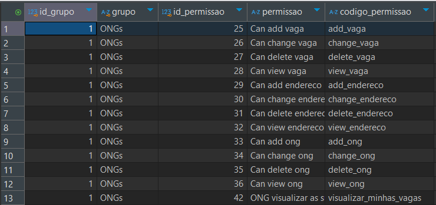
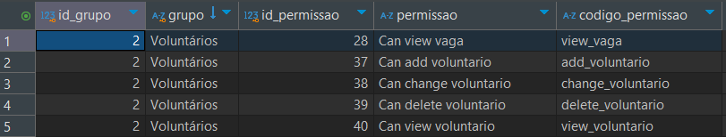

# WeOng

Este projeto tem como objetivo conectar ONGs e voluntários que gostariam de contribuir positivamente com o seu trabalho de forma voluntária. Este sistema está sendo criado para o Trabalho de Conclusão de Curso do curso de Ciência da Computação pela Universidade Paulista.


## Rodando Localmente

Clone o projeto

```bash
  git clone https://github.com/kayanerocha/weong.git
```

Entre no diretório do projeto

```bash
  cd weong
```

Crie o ambiente virtual

```bash
  python -m venv .venv
```

Ative o ambiente virtual

```bash
  .venv\Scripts\activate
```

Instale as bibliotecas

```bash
  pip install -r requirements.txt
```

### Variáveis de Ambiente

Para rodar esse projeto, você vai precisar adicionar as seguintes variáveis de ambiente no seu .env (`copy .env.example .env`)

`DB_HOST`

`DB_NAME`

`DB_USER`

`DB_PASSWORD`

`DB_PORT`

`GEOCODER_API_KEY`

Aplique as migrações (precisa de um banco de dados MySQL chamado weong)

```bash
  python weong\\manage.py migrate
```

Inicie o servidor (pode alterar a porta para uma que esteja disponível)

```bash
  python weong\\manage.py runserver 7000
```

Crie um usuário administrador

```bash
  python weong\\manage.py createsuperuser
```

### Permissões

Para restringir o que ONGs e voluntários podem fazer basta criar dois grupos do painel de administração, adicionar as permissões e adicionar os usuários aos seus respectivos grupos. Abaixo a configuração atual das permissões:
#### ONGs


#### Voluntários



## Contribuindo

Sempre que for iniciar qualquer desenvolvimento criar uma nova branch com base na branch `main` e nomear a branch com base no que está sendo feito. Após o desenvolvimento e tudo funcionando fazer o merge com a branch `main`.

De preferência seguir os padrões explicados no artigo [Padrões e Nomenclaturas no Git](https://www.brunodulcetti.com/padroes-e-nomenclaturas-no-git/).

Comandos úteis:
- Trocar de branch existente: `git checkout nomedabranch`
- Trocar e criar nova branch: `git checkout -b nomedabranch`
- Adicionar alterações: `git add nomearquivo`
- Commitar: `git commit -m 'commit'`
- Subir as alterações: `git push`
- Merge: `git merge nomedabranch`


## Stack Utilizada

**Front-end:** Bootstrap

**Back-end:** Django


## Autores

- [@nana-marques](https://github.com/nana-marques)
- [@HeitorExp](https://github.com/HeitorExp)
- [@ellensolv](https://github.com/ellensolv)
- [@kayanerocha](https://github.com/kayanerocha)
- [@prazeresmath](https://github.com/prazeresmath)

